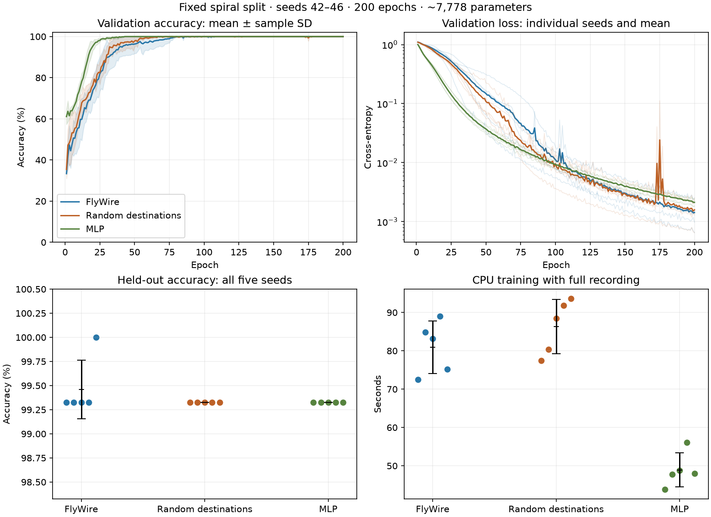

# Five-seed CPU baseline comparison

Completed all 15 predeclared runs (three architectures, seeds 42–46). All
recordings passed independent audits. No runs were excluded and no settings
were tuned after observing these results. See [protocol](PROTOCOL.md).

## Results

Values are mean ± sample standard deviation across five seeds.

| Architecture | Parameters | Test accuracy (%) | Test loss | First validation ≥95% epoch | Recorded training (s) |
|---|---:|---:|---:|---:|---:|
| FlyWire | 7,778 | 99.46 ± 0.30 | 0.1291 ± 0.1132 | 42.2 ± 18.7 | 81.0 ± 6.9 |
| Random destinations | 7,778 | 99.32 ± 0.00 | 0.0816 ± 0.0485 | 35.2 ± 10.0 | 86.3 ± 7.1 |
| MLP | 7,779 | 99.32 ± 0.00 | 0.0333 ± 0.0210 | 19.6 ± 2.3 | 48.9 ± 4.4 |



## Paired differences

- FlyWire minus Random destinations test accuracy: +0.135 percentage points on average; 1 wins, 4 ties, 0 losses across paired seeds.
- FlyWire minus MLP test accuracy: +0.135 percentage points on average; 1 wins, 4 ties, 0 losses across paired seeds.

The MLP reached 95% validation accuracy before FlyWire and the random
control in all five paired seeds. Its mean recorded runtime and mean test
cross-entropy were also lower. FlyWire's small accuracy lead consists of one
additional correct prediction at seed 46; it is not a consistent accuracy
separation across seeds. The evidence does not establish a fly-wiring advantage.

Peak process working set (mean ± sample SD, MiB): FlyWire 286.2 ± 0.5; Random destinations 286.3 ± 0.9; MLP 278.7 ± 0.3.

The independent [matching audit](matching_audit.json) confirmed identical
paired minibatch sequences, dataset bytes, recurrent IO initialization,
edge budgets and source-sign assignments. The random graphs retain about
81.5–82.0% of original edge positions, as expected for this dense circuit
under source-degree constraints; this limits how strongly this control
perturbs the topology. Signed edge totals match: 2,596 inhibitory and
5,019 excitatory edges per recurrent network.

## Interpretation and limits

This is a small, dense connectome circuit on one synthetic classification
task. Five runs share the same train/validation/test split; the error bars
measure training variability, not uncertainty across tasks or data splits.
With 148 test points, one changed prediction moves a run by about 0.676
percentage points. Small differences near the accuracy ceiling do not
establish a biological advantage.

The random control preserves source degree, source sign, self-loop policy
and per-source synapse-count multiset; incoming degrees and motifs differ.
The MLP matches parameter count within one parameter, but uses different
depth, initialization, unconstrained signs and computation. None of these
results alone proves a mechanism or transfers to reinforcement learning.

Runtime includes full activity/parameter recording and excludes startup,
initial evaluation and post-training audit. Captured activity sizes differ;
background load and disk writes affect timing. It is not a pure model-speed
benchmark. Peak process working set includes the Python runtime and recorder.

## Artifacts and verification

- Total captured sample-forwards: 4,693,560.
- Full run artifacts: 8.78 GiB, retained locally under `artifacts/synthetic/baseline_comparison_100/`.
- [Per-seed metrics](per_seed.csv), [aggregate statistics](summary.json), and `results/` contain compact results, histories, configuration and source hashes.
- Every audit checks committed arrays, sample/split assignments, parameter-version availability and three reproduced forward passes.
- The selected checkpoint is the minimum-validation-loss epoch; test is evaluated once per full run afterward.
- Two-epoch smoke runs preceded the full experiment and are excluded from these results.
- MLP traces use schema 2 (hidden layers with offsets); the existing recurrent viewer accepts schema 1 only.

## Next work

Keep all three architectures for the next stage. Before claiming a wiring
benefit, compare predeclared harder tasks and independent dataset splits,
or a less dense circuit where topology controls differ more substantially.
A minimal toy-combat environment can now be developed as the next task,
with synchronized observation/action/reward/activity recording and the same
baseline comparisons. Larger models or GPU setup are not required to begin.

## Reproduce

From the repository root, using a fresh output directory:

```powershell
.\.venv\Scripts\python.exe tools/run_comparison.py --output artifacts/synthetic/baseline_comparison_100_repeat --results experiments/baseline_comparison_100_repeat/results
.\.venv\Scripts\python.exe tools/summarize_comparison.py --results experiments/baseline_comparison_100_repeat/results
```
