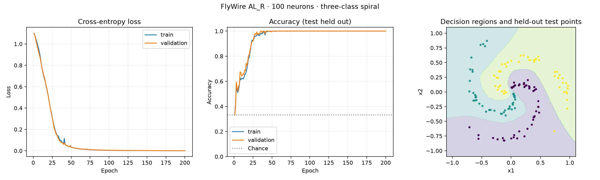

# First CPU training result

Run completed September 17, 2026, using the configuration and source fingerprints
recorded in [seed_42/provenance.json](seed_42/provenance.json).

| Measure | Result |
|---|---|
| Graph | FlyWire v783, AL_R, top 100 neurons by degree |
| Directed edges | 7,615 |
| Trainable parameters | 7,778 |
| Initialization | Synapse counts normalized by target incoming sum |
| Message-passing steps | 3 |
| Train / validation / test examples | 704 / 148 / 148 |
| Epochs | 200 |
| Selected checkpoint | Epoch 200, minimum validation loss |
| Training accuracy | 100% |
| Validation accuracy | 100% |
| Test accuracy | 99.324% (147 / 148) |
| CPU training time | 20.19 seconds, four PyTorch threads |

The test set was evaluated after checkpoint selection using validation loss.
Training checks verified finite gradients, nonzero gradients in the connectome
core, and preserved topology and weight signs after every optimizer update.

All 100 selected neurons are annotated intrinsic. The 10 input and 10 output
neurons are explicit computational fallbacks, leaving 80 hidden neurons. The
subgraph is weakly connected, and every output is reachable from the inputs in
exactly three message-passing steps. Its density is 76.15% including possible
self-pairs; this small selected circuit is not representative of whole-brain
sparsity. Neurotransmitter-based sign constraints are modeling assumptions.

This is one seed on one synthetic task. It does not establish a benefit over
random sparse networks or MLPs, biological fidelity, or readiness for CS2.
Additional seed runs and baseline comparisons remain pending.

## Saved files

- `model.pt`: selected state dictionary, configuration, and best epoch.
- `adjacency.npz`, `graph.npz`: exact graph, neuron IDs, signs, and IO indices.
- `dataset.npz`: generated features, labels, and disjoint split indices.
- `metrics.json`, `history.json`: evaluation summary and learning curves.
- `config.yaml`, `provenance.json`: configuration, package versions, data and code hashes.
- `training.png`: curves and decision regions.

The recorded Git commit predates these then-uncommitted implementation changes;
`git_dirty: true` and the individual source hashes capture that fact. This directory
is an archival copy of the original `artifacts/synthetic/synthetic_spiral_100/seed_42` run.

Data sources: [FlyWire connectivity v783](https://zenodo.org/records/10676866)
and [FlyWire neuron annotations](https://github.com/flyconnectome/flywire_annotations).
The large original datasets and downloaded software are not included in Git.
