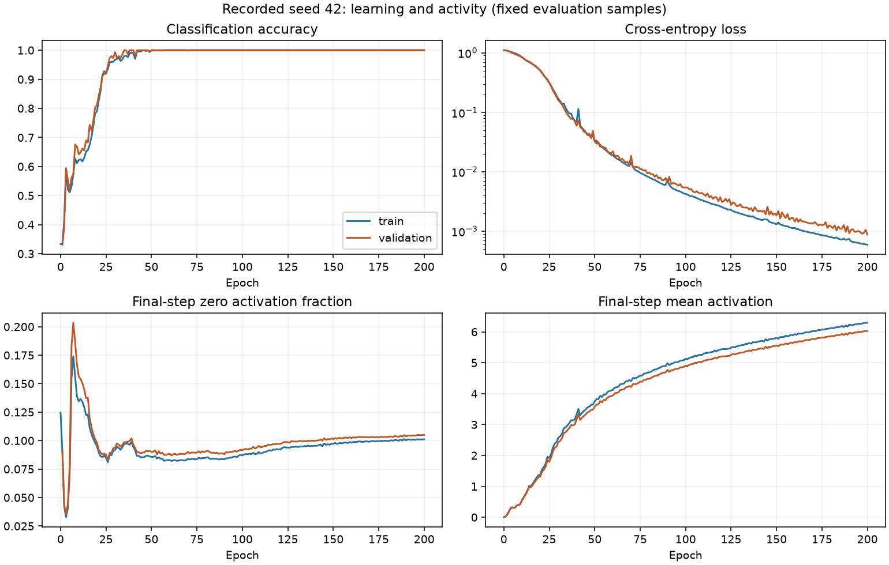
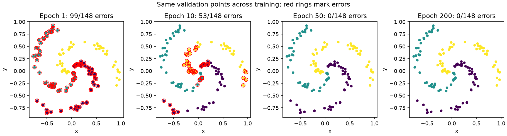
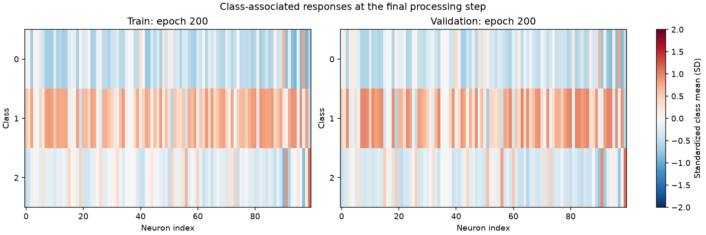

# First activity analysis: recorded seed 42

The model learns distinct class-associated responses, with similar aggregate
activity on training and validation inputs. No neuron is completely inactive
across all processing steps at the final checkpoint. These observations describe
one learned classifier; they do not establish an advantage from fly wiring.

## Scope and verification

Analyzed run `9c517c96-33f3-4c48-81c0-31588f073f20`, the copied 200-epoch CPU
recording. Every epoch's fixed evaluation sets contain 704 training and 148
validation inputs. Initialization is recorded for training only; validation
starts at epoch 1. Optimizer batches and selected-checkpoint duplicates are
excluded from these summaries. Held-out test events are excluded from analysis.

The recording passed the separate-process audit on this PC. The analysis checks
sample IDs against split membership and recomputes all 400 epoch evaluations;
their loss and accuracy agree with the separately saved training history.
Early/late training comparisons align identical sample IDs. No new training or
model changes were performed.

## 1. Most accuracy improvement happens early

| Measurement | Training | Validation |
|---|---:|---:|
| First epoch reaching at least 95% accuracy | 27 | 27 |
| First epoch reaching 100% accuracy | 46 | 35 |
| Epoch 200 accuracy | 100% | 100% |
| Epoch 200 cross-entropy | 0.000593 | 0.000876 |

These are first crossings, not guarantees that accuracy remains perfect from
that epoch onward. Validation errors fall from 99/148 at epoch 1 to 53/148 at
epoch 10, with none at the inspected epochs 50, 100 and 200. Loss continues to
decrease after accuracy approaches its ceiling, meaning the model increasingly
assigns probability to correct labels. This alone does not establish calibration.





**Implication:** for future comparisons, measure time/epochs to a fixed accuracy
threshold as well as final accuracy. This easy task's accuracy ceiling can hide
differences between architectures. Do not select a shorter training budget from
this single run without validating it across seeds.

## 2. Activity changes substantially through the three steps

At epoch 200, mean activation and exact-zero fractions are:

| Step | Training mean | Validation mean | Training zeros | Validation zeros |
|---|---:|---:|---:|---:|
| 1 | 0.397 | 0.406 | 21.85% | 21.01% |
| 2 | 1.360 | 1.349 | 35.49% | 39.24% |
| 3 | 6.298 | 6.032 | 10.12% | 10.50% |

Fractions count sample-neuron pairs, excluding input injection. Step 2 is more
sparse, while step 3 has larger and more widespread positive values. On the same
704 training inputs, mean final-step activation rises from 0.00399 at
initialization to 6.298 at epoch 200. Larger values are not inherently better,
and these three steps do not demonstrate stability over longer recurrences.

**Implication:** retain activation magnitude and sparsity diagnostics when
scaling. Similar train/validation averages are reassuring for this split but
do not prove generalization to a different task or input distribution.

## 3. Two neurons are silent at the final step, but not throughout processing

At epoch 200, internal neurons **36 and 37** are exactly zero at step 3 for
every training and validation input. At steps 1 and 2, every neuron is active
for at least one input in each split. Thus no neuron is silent across all three
steps on either evaluated split.

**Implication:** do not prune 36 and 37 based on final-step colors. They can
participate earlier. Testing necessity would require controlled interventions
(for example, suppressing a neuron at a specified step), followed by evaluation.
No such causal tests have been performed.

## 4. Neurons show class-associated responses

The heatmap subtracts each neuron's overall mean from its class mean and divides
by its standard deviation, separately within each split. White columns for
constant neurons use zero by convention. Colors measure relative class
responses, not raw activation or anatomical function.



Output neuron **99** has the strongest class association by the descriptive
eta-squared metric: 0.615 on training and 0.592 on validation. This metric is the
fraction of activation variation explained by differences between class means;
it is not prediction accuracy or a causal importance score. On validation,
neuron 99's mean activity is 1.22 for class 0, 1.06 for class 1, and 4.31 for
class 2. Output neuron **94** has corresponding means 0.92, 10.75, and 4.98.
Both neurons rank first and second on training and validation by this metric.

Class 1 evokes broadly higher mean responses in much of the network; the output
neurons show more varied class profiles. This suggests a distributed
representation rather than a unique neuron for each class, but correlated
activity alone cannot reveal which computations are necessary.

**Implication:** follow these response profiles across seeds and baselines.
Avoid interpreting them as biological brain regions or game-action circuits.

## Next experiment

Fix duplicate-edge sampling and sign matching in the random baseline, and match
the conventional network's parameter budget. Then compare seeds 42-46 under
equivalent training and evaluation rules, recording accuracy, threshold-crossing
time, loss, activation statistics, runtime and memory. Keep the held-out test
set reserved for final evaluation. Repeated-seed runs on the same dataset split
measure training variability, not variability across independently drawn tasks.

There is no evidence here that pruning, increasing network size, or moving to
GPU training would improve results. Fair architecture comparisons remain the
next priority before toy combat.

## Reproduce

From the project root:

```powershell
.\.venv\Scripts\python.exe tools/analyze_recording.py --run artifacts/synthetic/recorded_spiral_100_cpu_v2 --output experiments/recorded_spiral_100/activity_analysis
```

The script regenerates summary files and plots in the output directory and does
not modify the source recording. `epoch_metrics.csv` contains evaluation metrics
for each epoch, `neurons.csv` contains final-step per-neuron summaries, and
`summary.json` contains the main findings. The raw recording remains outside Git.
