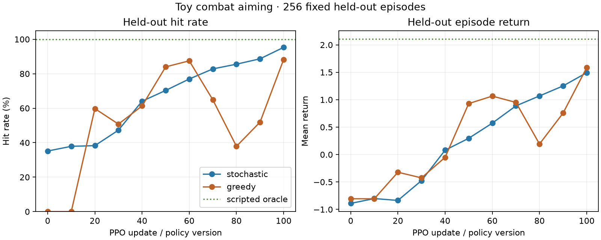

# First recorded toy-combat learning milestone

The 100-neuron FlyWire policy learned the stationary-target aiming curriculum on
CPU. On 256 fixed held-out episode seeds, stochastic hit rate rose from **35.2%**
at initialization to **95.3%** after 100 PPO updates. Mean episode return rose
from **-0.89** to **+1.49**. The final greedy policy hit **88.3%**, compared with
0% initially. This establishes learnability and action-aligned recording; it is
not evidence that fly wiring is better than another architecture.



## Fixed protocol

See [the predeclared protocol](PROTOCOL.md). The first curriculum masks movement
and exposes wait, turn left/right, and fire. Movement remains implemented in the
stable eight-action interface for the navigation stage. The target is stationary
and visible, and obstacles do not block its initial line of sight.

| Policy | Held-out stochastic hit rate | Mean return | Mean episode decisions |
|---|---:|---:|---:|
| Initial (version 0) | 35.2% | -0.890 | 32.7 |
| Trained (version 100) | 95.3% | +1.492 | 13.8 |
| Scripted solvability controller | 100.0% | +2.109 | 4.8 |

The final greedy policy achieves 88.3% with mean return +1.585 and 10.2 decisions.
The stochastic policy is the primary PPO result because PPO trains a distribution
and exploration remains active. Greedy results show that a useful deterministic
policy also emerged.

## Training and recording

- Seed 42; 8 parallel environments; 100 updates; horizon 64; 51,200 decisions.
- 2,331 completed training episodes, with 1,669 hits. Recent 100-episode hit rate
  was 92%; total hit rate includes early exploration and was 71.6%.
- CPU training plus complete rollout recording took 38.8 seconds.
- The local recording uses 104 MiB and stores every observation, action mask,
  input projection, all 100 neuron activations at all three processing steps,
  logits/probabilities, sampled and executed action, log probability, entropy,
  value estimate, reward components, next state, outcome, episode boundary, and
  exact policy version.
- All 51,200 decisions passed separate-process replay: model outputs and internal
  activations were reproduced from saved weights, and environment consequences
  were recreated from episode seeds and executed actions.

The full trace remains local at
`artifacts/toy_combat/flywire_ppo_seed_42_aiming_v1/`. Compact training metrics,
update diagnostics, evaluation data, the plot, and the protocol are committed.

## What the exploratory runs taught us

Two earlier local runs used all movement actions from the start and weaker hit
and aim-progress rewards. PPO learned to rotate until timeout and avoid miss
penalties: return improved without reliable hits. Held-out evaluation exposed
that failure. The fixed curriculum narrows the first task to aiming, raises the
hit reward from +1 to +2, and raises aim-progress scale from 0.05 to 0.2. Exact
threshold comparisons also received a numerical tolerance after float32 values
at exactly 11.25 degrees fell just below the mathematical boundary.

## Interpretation and next step

This result comes from one training seed and one architecture. It answers the
engineering question—our connectome model, environment, PPO loop, and recorder
work together—but not the scientific comparison question. The subsequent
[five-seed matched comparison](../toy_combat_baseline_comparison/README.md) is
complete: random wiring and the MLP outperform FlyWire on this aiming task.
The next stage is movement and navigation without changing the eight-action
interface.

## Reproduce

```powershell
.\.venv\Scripts\python.exe -m training.train_toy_combat --output artifacts/toy_combat/flywire_ppo_seed_42_repeat --updates 100 --workers 8 --horizon 64 --seed 42 --action-repeat 2
.\.venv\Scripts\python.exe tools/verify_combat_recording.py --run artifacts/toy_combat/flywire_ppo_seed_42_repeat
.\.venv\Scripts\python.exe tools/evaluate_toy_combat.py --run artifacts/toy_combat/flywire_ppo_seed_42_repeat --output experiments/toy_combat_aiming_repeat --episodes 256
```
