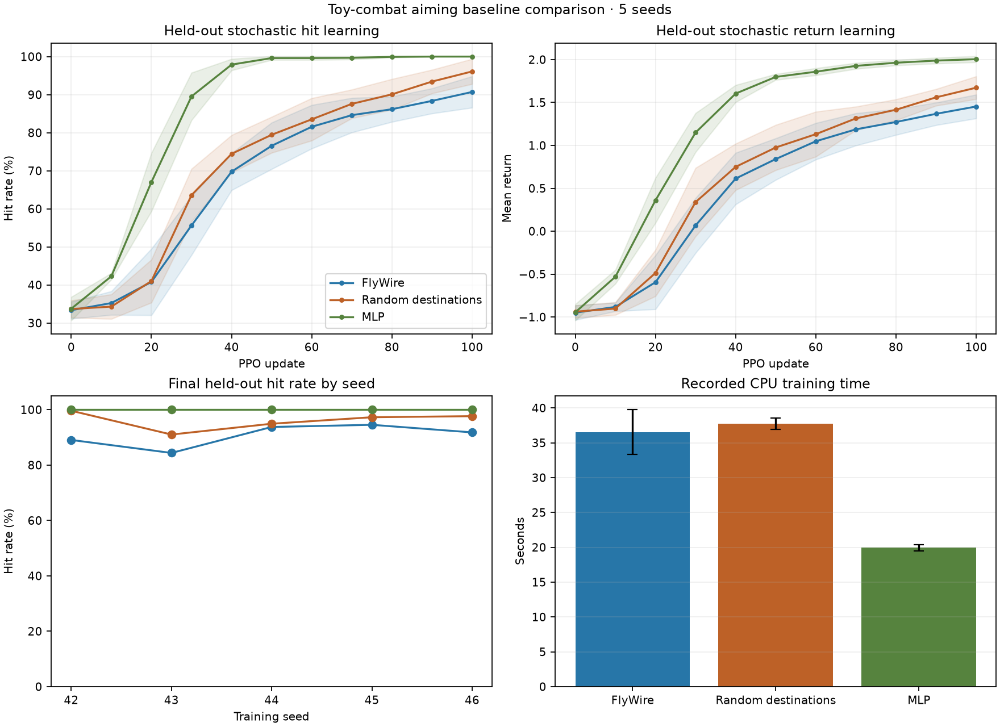

# Five-seed toy-combat aiming comparison

All 15 predeclared CPU runs completed and passed independent replay. On the
stationary-target aiming curriculum, the parameter-matched MLP learned fastest
and reached a 100% final stochastic hit rate in every seed. Randomized recurrent
wiring also outperformed FlyWire on the primary hit-rate and return endpoints in
all five paired seeds. This experiment provides no evidence of a FlyWire wiring
advantage on this task.

See the [fixed protocol](PROTOCOL.md), the transparent
[replay-tolerance amendment](AUDIT_AMENDMENT.md), and the
[architecture matching audit](matching_audit.json).



## Primary results

Values are mean ± sample standard deviation across training seeds 42-46. Each
held-out evaluation uses the same 256 episode seeds. Hit-curve AUC is the mean
stochastic hit rate over saved versions 0, 10, ..., 100.

| Architecture | Parameters | Initial hit (%) | Final hit (%) | Final return | Hit AUC (%) |
|---|---:|---:|---:|---:|---:|
| FlyWire | 7,913 | 33.4 ± 2.2 | 90.7 ± 4.1 | 1.453 ± 0.138 | 68.1 ± 4.2 |
| Random destinations | 7,913 | 33.7 ± 2.3 | 96.1 ± 3.3 | 1.672 ± 0.133 | 71.2 ± 2.8 |
| MLP | 7,913 | 33.8 ± 3.1 | 100.0 ± 0.0 | 2.005 ± 0.035 | 86.2 ± 1.4 |

The similar initial hit rates show that the final separation did not come from
one architecture starting with a large performance advantage.

## Paired outcomes

- FlyWire minus random final stochastic hit rate: **-5.39 ± 3.65 percentage
  points**. FlyWire had 0 wins, 0 ties, and 5 losses. The mean return difference
  was -0.219, and the hit-curve AUC difference was -3.16 points.
- FlyWire minus MLP final stochastic hit rate: **-9.30 ± 4.12 percentage
  points**. FlyWire had 0 wins, 0 ties, and 5 losses. The mean return difference
  was -0.552, and the hit-curve AUC difference was -18.17 points.

The per-seed final hit rates are available in [per_seed.csv](per_seed.csv), and
[summary.json](summary.json) contains all aggregate and paired values.

## Secondary results

| Architecture | Final greedy hit (%) | Final episode decisions | Recorded training (s) | Trace per run (MiB) |
|---|---:|---:|---:|---:|
| FlyWire | 46.9 ± 34.6 | 16.6 ± 1.9 | 36.5 ± 3.2 | 105.5 ± 5.5 |
| Random destinations | 77.9 ± 30.4 | 13.6 ± 2.3 | 37.7 ± 0.8 | 106.7 ± 3.9 |
| MLP | 99.6 ± 0.4 | 6.5 ± 0.8 | 19.9 ± 0.4 | 58.2 ± 2.3 |

Greedy recurrent performance is unstable across seeds even when stochastic PPO
performance is strong. The stochastic policy is the primary result because PPO
optimizes a distribution and the protocol fixed that endpoint in advance.

Recorded time is not a clean kernel-speed benchmark. MLP traces retain 318
hidden pre/post-activation values per decision, while recurrent traces retain
710 sensory, state, and preactivation values across the injected state and three
processing steps. Disk-write volume therefore differs substantially.

## Recording and audit

- 768,000 rollout decisions and 47,880 completed training episodes across all
  runs; no completed run was excluded or selected by outcome.
- Every decision retains synchronized observations, masks, actions, logits,
  probabilities, values, rewards, outcomes, actor version, and hidden activity.
- Every decision passed separate policy and environment replay. The first eight
  runs passed `atol=1e-6`; all later runs passed the uniformly amended
  `atol=5e-6`. Environment observations stayed at `1e-7` and rewards at `1e-6`.
- Model structure remained fixed for every policy update. FlyWire and random
  topology and sign buffers also remained fixed.
- Full local artifacts use 1.32 GiB under
  `artifacts/toy_combat/baseline_comparison_aiming_v1/`. The compact committed
  results include per-run configuration, metrics, all update diagnostics,
  evaluation values, audits, source hashes, and run IDs.

See [experiment_audit.json](experiment_audit.json) for the aggregate completion
and replay counts.

The matching audit confirms exact actor parameter counts, identical recurrent
IO initialization within each seed, and preservation of source degree, source
sign, self-loops, and per-source synapse-count multisets. Because the circuit is
dense, the randomized controls retain 81.5-82.0% of original edge positions.
This makes the random topology contrast weaker than it would be in a sparse
circuit.

## Interpretation and next step

The observation directly exposes aiming geometry, making this a favorable
feedforward-control problem. The MLP ceiling and short episodes show that the
task is now solved well enough to move on. These five seeds cover one environment
distribution, so they do not establish a broad ordering of architectures or a
mechanistic reason for the observed differences.

The next experiment should enable movement and introduce navigation, occlusion,
and longer credit assignment while preserving the eight-action interface and
the same three matched actors. That task should be fixed before full runs and
should retain stochastic evaluation, because greedy recurrent behavior here is
too variable to use as the primary endpoint.

## Reproduce

```powershell
.\.venv\Scripts\python.exe tools/run_toy_combat_comparison.py --output artifacts/toy_combat/baseline_comparison_aiming_repeat --results experiments/toy_combat_baseline_comparison_repeat/results
.\.venv\Scripts\python.exe tools/summarize_toy_combat_comparison.py --results experiments/toy_combat_baseline_comparison_repeat/results
```
