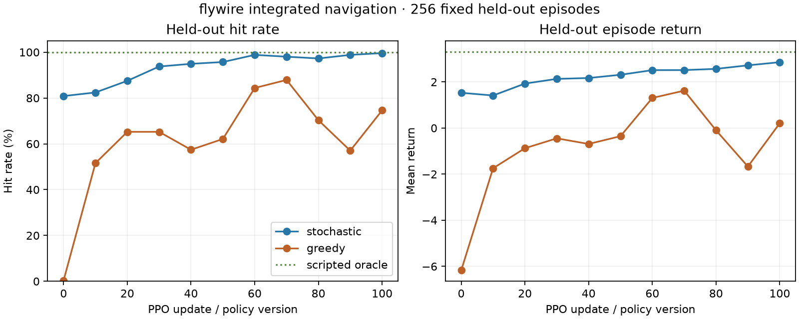

# Integrated FlyWire navigation milestone

The FlyWire controller now moves, turns, waits, aims, and fires with all actions
available in the same policy. Navigation phase masking is disabled: movement is
still available after line-of-sight acquisition and firing is available while
occluded, subject only to the ordinary fire cooldown.

The actor was transferred from the independently confirmed first navigation
policy and fine-tuned under the [predeclared protocol](PROTOCOL.md). On 256 fixed
held-out layouts, stochastic hit rate rose from **80.9%** at transferred version
0 to **99.6%** after 100 PPO updates. Mean return rose from **+1.530** to
**+2.857**, and mean episode length fell from 64.3 to 31.2 decisions.



| Policy | Hit rate | LOS acquired | Firing alignment | Fired | Mean return | Mean decisions |
|---|---:|---:|---:|---:|---:|---:|
| Transferred stochastic (v0) | 80.9% | 100.0% | 97.3% | 100.0% | +1.530 | 64.3 |
| Fine-tuned stochastic (v100) | 99.6% | 100.0% | 100.0% | 100.0% | +2.857 | 31.2 |
| Fine-tuned greedy diagnostic | 74.6% | 76.2% | 75.0% | 100.0% | +0.208 | 45.3 |
| Privileged solvability oracle | 100.0% | — | — | — | +3.313 | 11.0 |

The primary endpoint improved by **18.8 percentage points**, exceeding the fixed
95% final and 10-point improvement thresholds. The final stochastic policy used
every action family during evaluation, including 1,616 movement decisions, 5,180
turns, 66 waits, and 1,126 fire actions. Its 99.6% score corresponds to 255 hits
in 256 layouts.

## Training, transfer, and recording

- Confirmation seed 53; eight workers; 100 updates; horizon 64; action repeat
  one; 51,200 decisions.
- Version 0 exactly loads version 100 of the seed-47 navigation confirmation.
  The source run ID, version, and weight SHA-256 are stored in the manifest.
- The 100-neuron actor retains all 7,615 FlyWire edges and their source signs. It
  has 14 inputs, eight action logits, and 7,953 trainable parameters.
- CPU training plus complete recording took 46.7 seconds. The final 100 training
  episodes achieved a 99% hit rate.
- An independent replay reproduced policy outputs, internal activity, action
  masks, rewards, and environment transitions for all 51,200 decisions.

The full 126 MB trace remains local at
`artifacts/toy_combat/integrated_navigation_flywire_seed_53_confirmation_v1/`.
Compact [training metrics](training_metrics.json), [update diagnostics](updates.json),
[evaluation](evaluation.json), [audit result](audit.json), and
[provenance](provenance.json) are committed here.

## Interpretation and next stage

This confirms that the FlyWire-derived policy can combine navigation and combat
actions without the phase scaffold. It supports the project's engineering goal;
it does not claim a performance advantage over conventional architectures.

The target is still stationary and its relative coordinates remain observable
through obstacles. The next curriculum should introduce controlled target motion
while retaining full recording. Once tracking is reliable, hiding target
coordinates during occlusion will test memory and longer credit assignment before
a live Counter-Strike observation and action bridge is attempted.

## Reproduce

```powershell
.\.venv\Scripts\python.exe -m training.train_toy_combat --output artifacts/toy_combat/integrated_navigation_flywire_seed_53_repeat --architecture flywire --scenario integrated-navigation --seed 53 --updates 100 --workers 8 --horizon 64 --action-repeat 1 --entropy-coefficient 0.01 --final-entropy-coefficient 0 --initial-policy-run artifacts/toy_combat/navigation_flywire_seed_47_confirmation_v1 --initial-policy-version 100
.\.venv\Scripts\python.exe tools/verify_combat_recording.py --run artifacts/toy_combat/integrated_navigation_flywire_seed_53_repeat
.\.venv\Scripts\python.exe tools/evaluate_toy_combat.py --run artifacts/toy_combat/integrated_navigation_flywire_seed_53_repeat --output experiments/toy_combat_integrated_navigation_repeat --episodes 256
```
