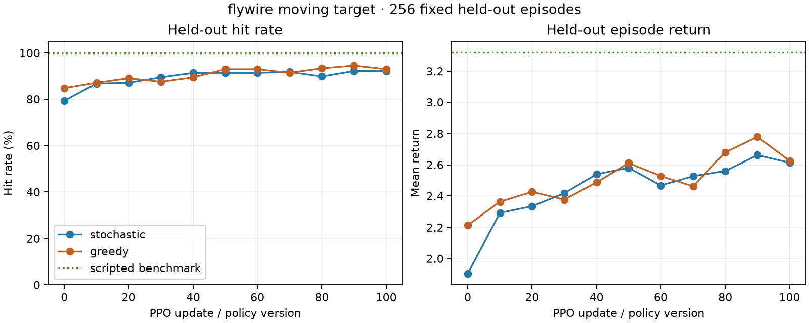

# Moving-target FlyWire milestone

The FlyWire-derived controller now tracks and hits a target that moves one grid
cell after every nonterminal decision. The target follows a deterministic,
obstacle-aware route while all eight agent actions remain available. On 256 fixed
held-out layouts, the successful replacement confirmation improves stochastic hit
rate from **79.3%** at transferred version 0 to **92.2%** after 100 PPO updates.



| Policy | Hit rate | LOS acquired | Firing alignment | Target moves | Mean return | Mean decisions |
|---|---:|---:|---:|---:|---:|---:|
| Transferred stochastic (v0) | 79.3% | 100.0% | 92.2% | 53.6 | +1.903 | 54.4 |
| Fine-tuned stochastic (v100) | 92.2% | 100.0% | 94.5% | 33.5 | +2.613 | 34.4 |
| Fine-tuned greedy diagnostic | 93.0% | 100.0% | 95.7% | 28.5 | +2.625 | 29.4 |
| Privileged reactive benchmark | 100.0% | — | — | — | +3.320 | 16.6 |

Target motion occurred in **100%** of held-out episodes. The final stochastic
controller faced an average of 33.5 target moves per episode, improved hit rate
by **12.9 percentage points**, and shortened episodes by 20 decisions. It passes
the [replacement protocol](PROTOCOL_V2.md): at least 90% final hit rate, at least
a 10-point gain, positive return, sufficient motion exposure, complete replay,
and preserved FlyWire topology/signs.

## Why there are two confirmation protocols

The [original protocol](PROTOCOL.md) used an entropy schedule from .01 to zero.
Its independent seed-61 run reached 87.1%, narrowly missing the fixed 88% final
and eight-point improvement thresholds. That result remains classified as a
[failed confirmation](CONFIRMATION_V1.md).

Post-failure diagnostics changed only the entropy coefficient. Zero entropy from
the first update raised the same seed from 87.1% to 93.4%, identifying excess
sampling diffusion. A new protocol was committed before running unseen seed 69;
that replacement confirmation produced the 92.2% result reported here.

## Training and recording

- Seed 69; sampled-action seed 70; minibatch seed 71; value seed 72.
- Eight workers, 100 updates, horizon 64, action repeat one, and zero entropy
  bonus; 51,200 recorded decisions.
- Version 0 exactly loads version 100 of the confirmed integrated-navigation run.
  Its run ID, policy version, and weight hash are stored in the manifest.
- The 100-neuron actor retains 7,615 fixed FlyWire edges and source signs, with
  14 observations, eight actions, and 7,953 trainable parameters.
- CPU training plus complete recording took 39.1 seconds. An independent audit
  reproduced every policy forward, internal activation, expanded environment
  state, target transition, reward, action, and outcome.

The full local trace is at
`artifacts/toy_combat/moving_target_flywire_seed_69_confirmation_v2/`. Compact
[metrics](training_metrics.json), [update diagnostics](updates.json),
[evaluation](evaluation.json), [audit result](audit.json), and
[provenance](provenance.json) are committed beside this report.

## Interpretation and next stage

This confirms reactive tracking against continuous deterministic target motion.
It advances the engineering objective but does not establish an advantage over
conventional architectures.

The policy still receives exact relative target coordinates through obstacles.
The next curriculum should hide those coordinates whenever line of sight is
blocked and expose the last visible target state or add temporal policy state.
That will turn occlusion into a memory and belief-state problem rather than a
purely reactive tracking task.

## Reproduce

```powershell
.\.venv\Scripts\python.exe -m training.train_toy_combat --output artifacts/toy_combat/moving_target_flywire_seed_69_repeat --architecture flywire --scenario moving-target --seed 69 --updates 100 --workers 8 --horizon 64 --action-repeat 1 --entropy-coefficient 0 --final-entropy-coefficient 0 --initial-policy-run artifacts/toy_combat/integrated_navigation_flywire_seed_53_confirmation_v1 --initial-policy-version 100
.\.venv\Scripts\python.exe tools/verify_combat_recording.py --run artifacts/toy_combat/moving_target_flywire_seed_69_repeat
.\.venv\Scripts\python.exe tools/evaluate_toy_combat.py --run artifacts/toy_combat/moving_target_flywire_seed_69_repeat --output experiments/toy_combat_moving_target_repeat --episodes 256
```
