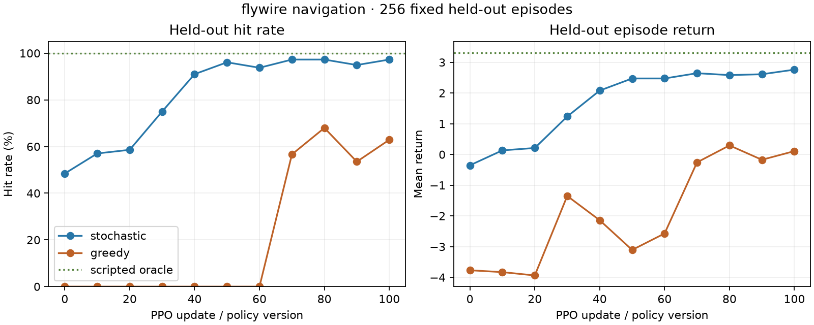

# First recorded FlyWire navigation milestone

The 100-neuron FlyWire policy learned the first navigation curriculum on CPU.
Every episode begins behind an obstacle. The controller must move until it gains
line of sight, then aim and fire. On 256 fixed held-out layouts, stochastic hit
rate rose from **48.4%** at initialization to **97.3%** after 100 PPO updates.
Mean return rose from **-0.354** to **+2.760**. This passes every success
criterion fixed in the [confirmation protocol](PROTOCOL.md).



| Policy | Hit rate | LOS acquired | Firing alignment | Mean return | Mean decisions |
|---|---:|---:|---:|---:|---:|
| Initial stochastic (v0) | 48.4% | 100.0% | 60.9% | -0.354 | 86.7 |
| Trained stochastic (v100) | 97.3% | 100.0% | 100.0% | +2.760 | 35.4 |
| Trained greedy diagnostic | 62.9% | 73.0% | 73.0% | +0.108 | 55.2 |
| Privileged solvability oracle | 100.0% | — | — | +3.313 | 11.0 |

The primary stochastic endpoint improved by **48.8 percentage points**, exceeds
the predeclared 85% threshold by 12.3 points, and has positive return. Version
100 acquired line of sight, reached firing alignment, and fired in all 256
held-out episodes. The oracle is a shortest-path environment check and was never
available to the learned controller.

## Training and recording

- Seed 47; eight parallel environments; 100 updates; horizon 64; action repeat
  one; 51,200 recorded decisions.
- The actor retains all 7,615 fixed FlyWire edges and source signs. Its 14-input,
  eight-action form has 7,953 trainable parameters.
- CPU training and complete recording took 51.4 seconds. The local full trace is
  126 MB and remains at
  `artifacts/toy_combat/navigation_flywire_seed_47_confirmation_v1/`.
- Recent training performance reached 97 hits in the final 100 episodes. Overall
  performance, including exploration, was 810/950 completed episodes.
- An independent audit reproduced model outputs, internal activity, and
  environment consequences for all 51,200 decisions. Topology and sign
  invariants also passed.

Compact [training metrics](training_metrics.json), [update diagnostics](updates.json),
[held-out evaluation](evaluation.json), [audit result](audit.json), and
[provenance](provenance.json) are committed beside this report.

## What this establishes

The FlyWire-derived controller now performs a compound combat behavior: it moves
through occlusion, gains visual access to a target, aligns, and shoots. The result
is an engineering milestone for the project objective, not evidence that FlyWire
wiring is superior to standard neural networks. The earlier matched aiming
comparison already showed that the controls can perform better on a simple task.

This curriculum still uses phase masking: firing is unavailable before line of
sight, and movement is unavailable afterward. The next stage is to relax that
scaffold so movement, aiming, and firing coexist. After that works reliably, add
moving targets and memory-dependent partial observability before attempting a
live Counter-Strike integration.

## Reproduce

```powershell
.\.venv\Scripts\python.exe -m training.train_toy_combat --output artifacts/toy_combat/navigation_flywire_seed_47_repeat --architecture flywire --scenario navigation --seed 47 --updates 100 --workers 8 --horizon 64 --action-repeat 1 --entropy-coefficient 0.01 --final-entropy-coefficient 0
.\.venv\Scripts\python.exe tools/verify_combat_recording.py --run artifacts/toy_combat/navigation_flywire_seed_47_repeat
.\.venv\Scripts\python.exe tools/evaluate_toy_combat.py --run artifacts/toy_combat/navigation_flywire_seed_47_repeat --output experiments/toy_combat_navigation_repeat --episodes 256
```
