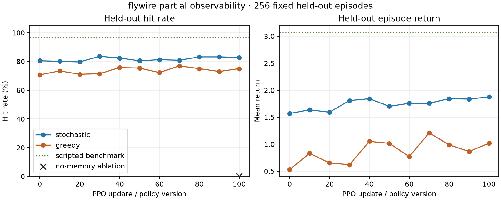

# Partial-observability FlyWire milestone

The FlyWire-derived controller now plays the complete toy-combat task without
seeing live target coordinates through obstacles. Before first sighting, target
geometry is zero; after sighting, later occlusion exposes only the last visible
position. On 256 fixed held-out layouts, the independent seed-77 confirmation
reaches **82.8% stochastic hit rate** while spending 73.5% of its decisions
without line of sight.



| Policy | Hit rate | LOS acquired | Occluded decisions | Occluded memory use | Mean return | Mean decisions |
|---|---:|---:|---:|---:|---:|---:|
| Transferred stochastic (v0) | 80.5% | 87.9% | 71.1% | 44.2% | +1.568 | 51.7 |
| Confirmed stochastic (v100) | **82.8%** | **85.9%** | **73.5%** | **38.7%** | **+1.876** | **48.3** |
| Confirmed greedy diagnostic | 75.0% | 85.9% | 77.8% | 45.5% | +1.017 | 51.2 |
| Final weights without memory | **0.0%** | 85.9% | 59.4% | 0.0% | -1.154 | 120.0 |
| Privileged scripted benchmark | 96.9% | — | — | — | +3.070 | 21.6 |

The no-memory row uses the same version-100 weights, stochastic action random
numbers, and held-out episode seeds. Its only intervention is to zero the
last-seen target geometry whenever line of sight is blocked. The 82.8-point drop
shows that the learned controller depends on remembered target state rather than
receiving current coordinates through walls. The ablated controller still
acquires line of sight in 85.9% of episodes, but almost never fires and never
hits, which is consistent with losing the state needed to resume tracking.

The final controller meets every [fixed confirmation criterion](PROTOCOL.md):
positive return, at least 80% hits, at least 85% line-of-sight acquisition, at
least 60% occluded decisions, memory available in at least 30% of occluded
decisions, an intervention effect of at least 60 points, sufficient continuous
target motion, preserved FlyWire topology and signs, and complete replay.

## What changed

- The environment uses 16 obstacles and starts behind occlusion. The target moves
  one cell after every nonterminal decision.
- Live relative target coordinates appear only with line of sight. During later
  occlusion, the same four observation channels describe the last visible target
  position and may become stale; their mean age when used was 9.2 ticks.
- Aim and distance shaping are disabled during occlusion so rewards do not reveal
  the hidden live position.
- The recorded privileged state retains the live target and remembered target for
  audit only. The policy never receives the privileged state.
- The evaluator automatically repeats the final policy with remembered geometry
  removed and records occlusion and memory metrics.

## Training and recording

- Seed 77; sampled-action seed 78; minibatch seed 79; value seed 80.
- Eight workers, 100 PPO updates, horizon 64, action repeat one, and zero entropy
  bonus; 51,200 recorded decisions.
- Version 0 exactly loads version 100 of confirmed moving-target run
  `moving_target_flywire_seed_69_confirmation_v2`. The source run ID and weight
  hash match the predeclared protocol.
- The actor retains 100 neurons, 7,615 fixed FlyWire edges and source signs, 14
  observations, eight actions, three within-decision message-passing steps, and
  7,953 trainable parameters.
- CPU training plus complete recording took 43.4 seconds. The independent audit
  reproduced all 51,200 policy forwards, activations, observations, privileged
  states, environment transitions, rewards, and outcomes.

Target motion occurred in 98.8% of held-out episodes and averaged 46.1 moves for
the final stochastic policy. Three layouts had no valid target move before the
episode ended, which remains above the fixed 95% exposure threshold.

The full local trace is at
`artifacts/toy_combat/partial_observability_flywire_seed_77_confirmation_v1/`.
Compact [metrics](training_metrics.json), [update diagnostics](updates.json),
[evaluation and intervention](evaluation.json), [audit result](audit.json), and
[provenance](provenance.json) are committed beside this report. The exploratory
environment sweep and temporal-state experiment are reported separately in
[EXPLORATION.md](EXPLORATION.md).

## Interpretation and next stage

This confirms a memory-dependent FlyWire controller in the toy environment. It
does not establish that FlyWire wiring is better than conventional models, and
that is not the project objective at this stage. The remembered position is an
explicit environment-maintained memory scaffold, not yet a learned belief state.

The next engineering step is the Counter-Strike observation and action bridge:
replace grid observations with captured game state, expose visibility-gated
target detections, map the eight actions to safe game controls, and first validate
the loop in an offline replay or controlled local match. The implemented
persistent neuron-state path can later be trained with sequence batches to move
more of the memory mechanism into the connectome controller itself.

## Reproduce

```powershell
.\.venv\Scripts\python.exe -m training.train_toy_combat --output artifacts/toy_combat/partial_observability_flywire_seed_77_repeat --architecture flywire --scenario partial-observability --seed 77 --updates 100 --workers 8 --horizon 64 --action-repeat 1 --entropy-coefficient 0 --final-entropy-coefficient 0 --initial-policy-run artifacts/toy_combat/moving_target_flywire_seed_69_confirmation_v2 --initial-policy-version 100
.\.venv\Scripts\python.exe tools/verify_combat_recording.py --run artifacts/toy_combat/partial_observability_flywire_seed_77_repeat
.\.venv\Scripts\python.exe tools/evaluate_toy_combat.py --run artifacts/toy_combat/partial_observability_flywire_seed_77_repeat --output experiments/toy_combat_partial_observability_repeat --episodes 256
```
